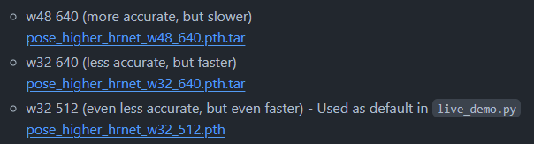
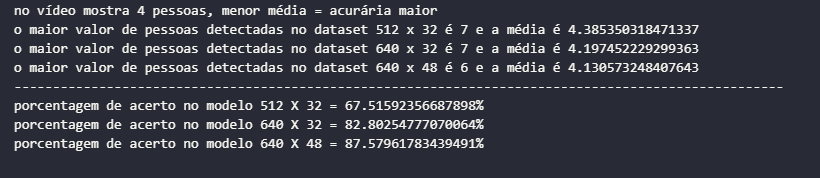

# Índice
1. [Resumo do projeto](#Resumo-do-projeto)
2. [Instalação](#Instalação)
3. [Configuração de Ambiente](#configuração-de-ambiente)
4. [Teste em vídeos](#teste-em-vídeos)
    - 4.1 [Metodologia dos testes](#metodologia-dos-testes)
5. [Extra - Teste em outros modelos](#extra---teste-em-outros-modelos)
6. [Análise de dados](#análise-de-dados)
    - 6.1 [Vídeo 1](#vídeo-1)
    - 6.2 [Vídeo 2](#vídeo-2)
    - 6.3 [Vídeo 3](#vídeo-3)
    - 6.4 [Vídeo 4](#vídeo-4)
7. [Conclusão](#conclusão)
8. [Projetos Futuros](#projetos-futuros)


# Resumo do projeto
O projeto proposto pela Voxar por meio da FADE-UFPE tem como objetivo realizar um projeto de visão computacional e deep learning para os participantes da segunda fase do processo seletivo de estágio do edital 024/2024. Me chamo **Miguel Cabral de Carvalho** de E-mail: [miguelccarvalho1@gmail.com](mailto:miguelccarvmiguelccarvalho1@gmail.com).
Nesse projeto temos como objetivo clonar o repositório [simple-HigherHRNet](https://github.com/stefanopini/simple-HigherHRNet), realizar a configuração do ambiente virtual utilizando o anaconda e realizar testes com o vídeo enviado utilizando alguns modelos. Além o que foi proposto resolvi fazer uma análise de dados captados durante os testes em diversos modelos e vídeos para analisar qual modelo faz mais sentido utilizar e em que cenário faz sentido.
# Instalação
Para a instalação do repositório precisei clonar o repositório utilizando o próprio *git bash* com o comando
```
git clone https://github.com/stefanopini/simple-HigherHRNet.git
```
depois precisamos caminhar até a pasta do arquivo utilizando o cd
```
cd simple-HigherHRNet
```
O processo de clonagem do repositório foi feito dessa forma, agora precisamos configurar o ambiente.
# Configuração de Ambiente
Para a configuração do ambiente utilizaremos o anaconda para organização das bibliotecas usadas pelo projeto utilizando um ambiente virtual, para organizar melhor o código.

Baixei o anaconda para windows e apesar de propor uma interface gráfico preferi utilizar pelo terminal pois já estou mais acustumado a executar comando por lá.

executei o comando sem especificar a versão do python:

```
conda create --name simple-analysis
```

 

e ativei usando o 

```
conda activate simple-analysis
```

Proximo passo, vou instalar as dependencias do projeto utilizando o arquivo requirements.txt.

```
pip install -r requirements.txt
```

Para o torch precisei realizar uma configuração extra, pois para utilizar meus núcleos cudas precisei procurar a versão específica que lida com o cuda toolkit da minha placa de vídeo atual.

então eu desinstalei a versão do torch atual e instalei a versão necessária utilizando os seguintes comandos

```
pip uninstall torch
pip install torch torchvision torchaudio --index-url https://download.pytorch.org/whl/cu121
```

Após isso o ambiente virtual está configurado corretamente.

# Teste em vídeos
No documento do projeto foi compartilhado um vídeo a ser utilizado nos testes como título de "panoptic" que tomei como liberdade para renomeiar para "video1" pois pretendo testar  outros videos também. No Readme do projeto é disponibilizado o código que é executado para realizar a medição de quantas pessoas estão no vídeo. procurei por vídeos na plataforma do youtube em que foram gravados por uma câmera estática onde pessoas passam pelo vídeo e adicionei para a lista de vídeos a serem analisados.

Falarei mais sobre como realizei os testes na proxima seção, os videos a serem testados serão:

video1 (video de 4 pessoas conversando):

 

video2 (5 pessoas caminhando e conversando) :

 

video3 (video de 3 pessoas jogando basquete em uma quadra):

 

video4 (video de 3 pessoas caminanhando em uma esteira):

 

Código a ser usando para executar o programa.
```
python scripts/live-demo.py --hrnet_c 32 -r 512 --hrnet_weights weights/pose_higher_hrnet_w32_512.pth --filename videos/video3.mp4
```
onde -r corresponde a resolução

--hrnet_c corresponde ao numero de canais

--hrnet-weights ao local dos modelos

--filename ao local do video

Ao realizar um simples teste é aberto o vídeo com os 'esqueletos' aplicados nas pessoas detectadas

 

## Metodologia dos testes
Tomei liberdade para criar um código em python que salva algumas informações em um arquivo csv de acordo com o andamento do código. O arquivo csv armazena informações do fps atual do vídeo, quantas pessoas foram detectadas no vídeo, resolução atual, numero de canais e o horário atual em que o vídeo começou e terminou, conforme o print a seguir:


Lugar do código 'live-demo.py' onde estou chamando minha função, precisei fazer alguns ajustes no nome do arquivo para sempre gerar csvs correspondentes ao modelo e ao vídeo do momento:

 

resultado dos csvs:


o objetivo dessa captação de dados é realizar posteriormente uma análise de dados e plotar uns gráficos para entender de fato qual é a principal diferença entre os modelos, falarei mais disso na proxima seção.

# Extra - Teste em outros modelos
Como extra do projeto devemos realizar o teste e análise entre os 3 modelos citados no readme do projeto principal:



nesse sentido criei um código em python capaz de realizar esses testes automatizados nos 4 vídeos, usando os 3 modelos disponíveis. Como os códigos já estão interligados com o código de criação dos csv para uma análise de dados precisei apenas roda-los uma vez, segue print do códido de automação dos testes:


# Análise de dados
Para a análise de dados utilizei da biblioteca pandas, e a matplotlib para fazer análises simples dos dados que coletei.
Criei um notebook em python com nome de main.ipynb que está presente nesse repositório. Importei os dados dos csvs que havia criado anteriormente e parti para a análise. Crei algumas funções para me ajudar no tratamento de alguns dados como por exemplo para realizar a diferença de tempo do início até o fim.


## Vídeo 1
primeiro fiz a plotagem dos dados de número de pessoas detectadas




já podemos perceber uma acurácia maior para os modelos mais potentes, mas e o tempo necessário para rodar?


de fato quanto maior o modelo mais demorado ele custa, vamos analisar esse custo agora


onde a média de fps foi bem menor para os modelos mais pesados


## Vídeo 2
para o vídeo 2 realizaremos o mesmo teste, primeiro o gráfico de número de pessoas: 


depois o tempo decorrido no video 2 pelos modelos


e por fim os gráficos do custo computacional (fps) do video 2


## Vídeo 3
Para o vídeo 3 primeiro plotei os gráficos de numero de pessoas detectadas no vídeo:


Interessante notar que o modelo de 640 x 32 gerou o mesmo tempo que o de 512 x 32, no entanto uma acurácia maior


maior o modelo menor a média de fps, maior o custo computacional.

## Vídeo 4

Com o vídeo 4 obtive um resultado interessante, acredito que esse video seja considerado 'facil' para o programa identificar pois os 3 modelos não apresentaram grande discrepância entre eles


A acurácia do modelo médio já ter atingido 100% mas o tempo de execução ser bem menor do que o modelo mais complexo já nos faz pensar se é sempre necessário utilizar o melhor modelo? a resposta talvez possa estar nos fps:


onde o modelo médio apresentou um fps maior até do que o modelo mais fraco, provavelmente seria a melhor escolha para esse vídeo.

# Conclusão
## Modelo com maior resolução e mais canais de fato representa uma acurácia maior?
Sim. Podemos concluir que de fato, quanto maior a resolução e o valor de canais mais o modelo irá acertar a quantidade de pessoas presentes no vídeo sem demonstrar uma porcentagem grande de erro.
## Modelos mais complexos demoram mais tempo para executar o código? se sim em quanto?
Sim, modelos mais complexos demoram mais para rodar, a diferença entre o modelo mais complexo para o modelo mais simples pode variar de 5% para até 33% de acordo com nossos testes em 4 vídeos.
## Modelos mais complexos são mais pesados e 'rodam' em framerates mais baixos?
Sim, os modelos mais complexos como comprovados nos testes acimas executam em um nível de framerate mais baixo, exigindo mais poder computacional.
## Se modelos mais complexos são melhores, devo usar-los sempre?
Depende, se o objetivo for o poder computacional for limitado e o 'video' a ser testado for de nível simples, talvez não seja necessário utilizar o modelo mais potente, como comprovado no video4, onde o modelo mediano já conseguiu suprir os 100% de acurácia e conseguiu realizar essa tarefa em cerca de 33% mais rápido do que o modelo mais potente.

## Projetos futuros
Para projetos futuros gostaria de refazer os testes testando também outros parâmetros e valores

- [ ] testes em outros dispositivos torch (vulkan, cpu)
- [ ] testar com os nucleos RT ativados
- [ ] testar em vídeos com câmeras em movimentos e com mais pessoas
- [ ] testar outros modelos mais complexos e outros menos complexos
- [ ] testar com número de bones menor e/ou maior
